## v-next: Remaining things to do
Socrates is now alive and supporting thread-level multi-turn conversations, with memory compaction, passive listening between @Socrates tags, and live user feedback fed back to a db. 

It's armed with parameterized, secure search tools for SQL search, BM25 search, and hybrid (BM25 + semantic search). The agent has an extensive eval suite across adversarial, semantic, deterministic, and aggregation samples.

See: @/eval_reports/final_eval_report.html
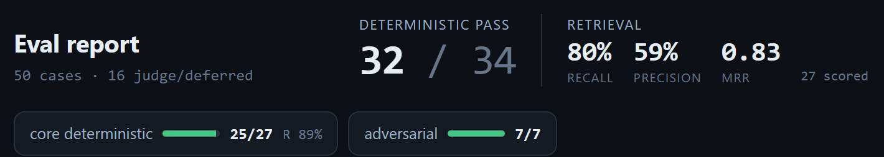

Between v0 and our latest iteration, we've raised our recall (60% -> 80%), precision (42% -> 60%), and MRR (0.5 -> 0.8). Our semantic & complex query answers are also much more accurate (the deterministic tests were already performing well). We've reduced the number of tool calls required (none > 6 in our suite, even with parallel tool calling enabled). 

The current agent architecture itself is fairly simplistic:


So what's next? Some things that I wish I got to, but ran out of time: 

- Overall pass/fail rates are pretty good, but both recall and precision can be improved
- Implementing an LLM as a judge on the eval suite (this will be useful to automatically score the more complex queries)
- Using that LLM judge to experiment with an adversarial agent to refine the quality of each output
- Since our deterministic queries were already performing extremely well, I would've liked to experiment with a router based model (where a classifier kicks off different calls to different LLM tiers). I'd bet that cheaper models can still answer the easy queries (deterministic evals in our golden set) at a very high success rate.
- It would've been interesting to test the discriminator against the adversarial eval suite.
- I didn't get a chance to set up tool-calling / trajectory evals. Those would've been helpful to track whether the expected tool calls are happening & enhancing our agent harness + prompts.


## v5: Security and guardrails

Security is, broadly speaking, a full stack concern. LLM inputs and outputs are notoriously difficult to manage, and input sanitization isn't enough (users can disguise inputs or attempt to inject seemingly safe data to be saved to a db for a downstream attack). 

Fortunately, the Socrates app will largely be used by a trusted audience (people added to a slack channel) and is connected to Slack via websocket (not exposed to public http traffic).

Furthermore, the app has these safety mechanisms implemented in prior versions: 

- `readonly` & `query_only` settings on SQLite db: protects against mutations & sql injections
- Tools are explicitly defined and parameterized (rather than a broad sql writing tool)
- Querying tables themselves operate on an allowlist (`ENTITY_SCHEMA`)
- We set a hard tool-call cap to bound runaway loops
- An adversarial portion of our eval test-suite
- User input normalization with a max input length (`normalizeUserInput`)
- A stub for `authorize` that's designed for LDAP systems and user permissions (leaving out of scope for this project)

For this v5, I've added two items not previously implemented: 

- Input bounds (500 char for queries, 200 char for filters, 50 items for id-list filters) for `searchArtifacts`
- A log-only classifier at the `handleUserQuestion` level. This cheap (haiku) classifier logs either "on_topic", "off_topic", or "injection_attempt". I don't have the time remaining to rigorously test this classifier w/ a meaningful eval suite to put it in the critical path, but that would be next on my list of things to do.

## v4: A more friendly slack bot & live feedback

Now, as mentioned in the core requirements file, agents can take a while to run, so we'll want the user to know that Socrates has seen the message and is working on it.

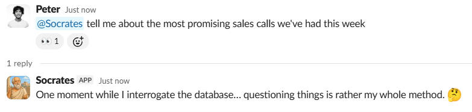

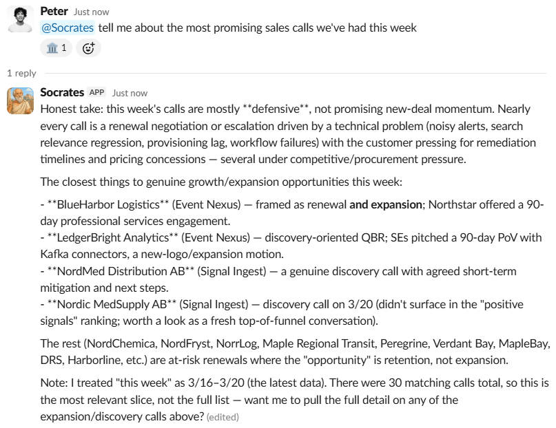

In my test cases so far, it's never been more than a couple seconds of runtime, and I've hard-capped the max-tool-call limit to 8. So I don't think latency is likely to stretch very long. Having said that, Socrates updates the user every second (to respect Slack's rate limit) with the number of tool calls it's done so far. 

Separately, what if we want Socrates to receive live feedback to inform our regression tests and eval suite? Well, the good news is that we can now give Socrates live feedback: 

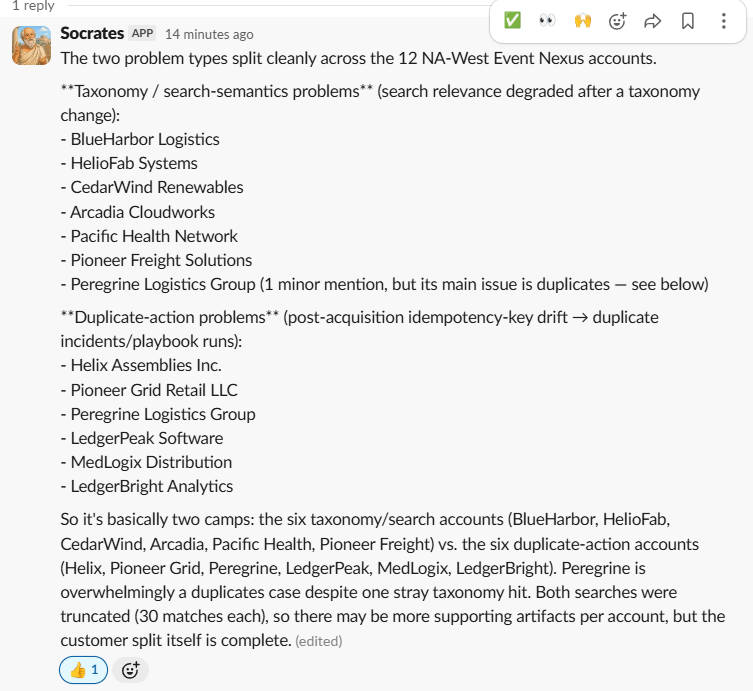

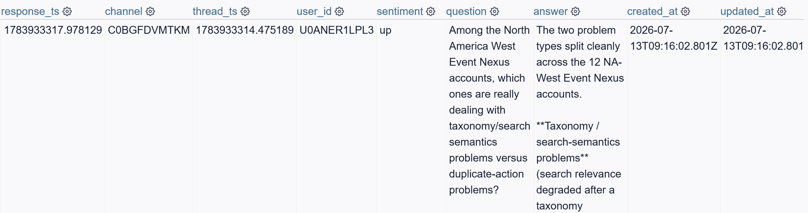

## v3: Multi-turn queries and memory management

Since we want multiple turn conversations and history, we'll need to pipe slack messages into the agent's context window.

For the purposes of this app, each new slack thread is a new conversation. Users (like me) want to be able to control when they start fresh, and slack threads are a clear delineation for that. 

We could pipe the entire slack thread into the agent's context, but for long-running conversations (imagine >100 messages), this leads to context bloat (less reliable outputs and $$$ expensive). 

Instead, memories are stored in a local SQLite db (see @/src/memory/thread-store). We maintain a per-thread message history up to a hard-coded `COMPACTION_THRESHOLD` (16 messages). When that limit is hit, we summarize the thread history, write to the `thread_summaries` table, and remove messages older than the `KEEP_RECENT` threshold (we keep the most recent 8). This keeps in check context bloat from long-conversations. (note: evals `gold_0015`, `gold_0016`, `gold_0028` test on this access pattern.) 

Now whenever Socrates (our chatbot) is asked "Tell me more about that", it'll know what "that" is referring to.

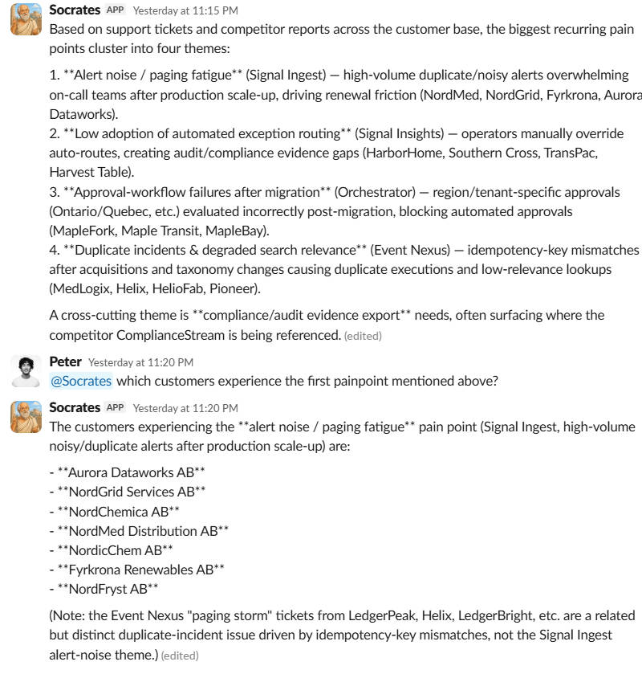

Now I know what you're thinking: what about messages that don't tag the Slack bot, and the slack bot only gets brought in later? 

Whenever the slack bot is tagged into a thread, it'll follow the same message history thresholds + compaction constraints mentioned above and save that thread history, then it'll execute on the user's query. 

Conversations in threads with our Slack Bot tagged are passively saved into the thread-store db. 

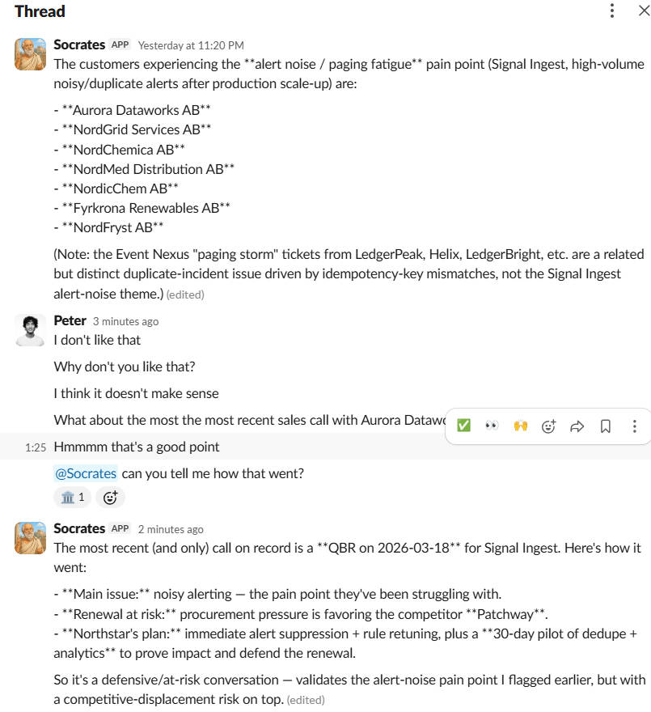

Other forms of memory could be relevant but I'm leaving out of scope for this project: 

- Organizational memory (memories about the organization's preferences or tendencies)
- Inter-thread memory (memories across conversations; say: if you wanted a cache of frequent recently asked questions)
- User-specific memory (memories that pertain to a specific user; like their preferences)

## v2: Semantic search

As mentioned in the previous section, our agent is currently struggling with complex semantic-leaning questions. It tends to brute force its results by calling many different keyword searches, reaching the tool-calling limit. In particular, the agent was stalling out and changing its keywords to find the correct artifacts.

So let's see if we can improve that with semantic search directly on artifacts. We'll need to convert artifacts into embeddings.

Normally, I'd use Pinecone or pgvector, but since this dataset is so small, I'll just store the embeddings in a local file (`artifact_embeddings.bin`). We could use sqlite-vec, but the local file approach is easier @250 rows.

With these embeddings, we have a few different approaches to semantic search: 
**A. Give the agent semantic search as a separate tool**
**B. Set up a deterministic pipeline for semantic search for every tool call**
**C. Embed semantic search inside of** `searchArtifacts` **which functionally turns it into a hybrid search tool** (we'd use RRF to reconcile the BM25 + semantic rankings)

Normally, hybrid search tools are good because they a. reduce the surface area for an agent to make mistakes (1 tool call vs 2) and b. expand recall breadth (the agent might not realize that there are relevant artifacts based on semantic meaning, but those artifacts are surfaced anyways). 

But it can also diminish precision (irrelevant semantic meaning might be attached to an otherwise standard keyword search)

I'm opting for C, with an option for the agent to turn off the extra semantic search (but it'll be discouraged from doing so, outside of 1 word lookups).

The mechanics of this search are simple:

User Query --> Agent defines search query --> tool call --> query embedded via openai call --> cosine similarity search against artifact vector --> Top-k vectors are reconciled with Top-k keyword-search via RRF --> ranked artifacts returned back to agent.

With this, the agent can lean more heavily on semantic meaning. As expected, it performs much better on recall, precision, and the tool count. 

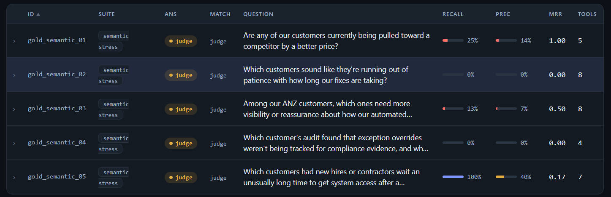

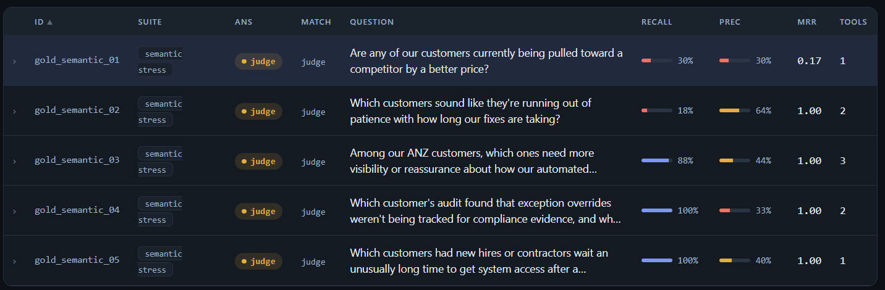

Before these changes, 2/5 of our semantic queries hit the tool-cap limit. Recall and precision were also extremely low.

Now, none of the semantic eval queries exceed 3 tool calls, and recall is much higher (since more artifacts are surfaced).

However, the agent still struggles with recall for semantic queries that require a wide evidence base (`gold_semantic_02` recall was at 18% despite precision at 64%). I believe the problem here is that the agent is given a lot of context, and has reasonably high confidence that its answer is good enough, without knowing that there's other useful information available.

I think two directions we could take to improve this are: 

- **Focus on precision**: Our precision on these semantic queries isn't very high. This leads to us missing other relevant information because the top-k outputs are imprecise. Some things we can do here: steer the agent's semantic querying pattern, experiment with how we're scoring and chunking the artifact vectors, revisit our hybrid search approach.
- **Let the agent know about relevant results beyond top-k**: We currently return some top-k results for the agent. Sometimes there are other relevant results that are further down the set. Nudging the agent to look for them is a bit brute-forcey, but should improve recall at the cost of precision & context bloat.

One thing I experimented with was giving the agent the ability to use facets in its `search_artifacts` tool, which gives us a better outline / shape for its search results (grouped by whichever facet columns it cares about.) However, the eval outputs were largely unchanged.

## v1: Initial Slack Bot + Sql Tooling

Since user questions are generally vague, and we're given a SQL database, our agent will need to convert human text to queries. Since there can be more than 1 query, and the agent must be able to determine when the answer is completed, we'll need a simple ReAct loop. 

I'm skipping a 1-shot or deterministic data pipeline because a. we don't always know what sql queries to run and b. feeding the entire dataset into the agent would be extremely expensive.

Even for a future semantic search, our agent would need to convert the user's query into a vector query.

ReAct graph: 

```
const graph = new StateGraph(MessagesAnnotation)
  .addNode("agent", callModel)
  .addNode("tools", new ToolNode(databaseTools))
  .addEdge(START, "agent")
  .addConditionalEdges("agent", shouldContinue, ["tools", END])
  .addEdge("tools", "agent")
  .compile();
```

`shouldContinue` is decided by whether the agent wants to make another tool call.

### Slackbot authenticating requests

- I'm opting to host this slack bot locally, rather than kick it up into a server. As a result, the server will connect to slack via a websocket, using Socket Mode. This allows us to avoid exposing a public HTTP endpoint. The Socket Mode connection is secure because it's a TLS encrypted connection authenticated by our app token.
- We'll maintain the `SLACK_APP_TOKEN`, which is used to open up the websocket (bolt will use it to create the connection) and the `SLACK_BOT_TOKEN` (which scopes the bot's permissions, and used to write events to slack) in our .env file.
- I don't think hosting this on the web & exposing a webhook is necessary. But if we had to, we need to validate inbound requests into the webhook via Slack's signing key.


### Initial benchmark (free-form sql)

Eventually, we'll want our slackbot to choose amongst a collection of tools.

For this V1, we'll focus on SQL search tooling, but I'd like to eventually expand this to include semantic search (via vector db). SQLite has a built-in BM25 structure (FTS5 ranking), so we should be able to leverage this.

First, I want to benchmark the agent armed with a generic `run_sql` tool to have a control-sample on how an agent performs with maximal tooling flexibility.

The outputs for this first run are in `/eval_reports/v0`. I documented the notes from this run in `/eval_reports/README.md`.

Our precision was interestingly quite low. One culprit is that the agent makes mistakes and retrieves more than required.


Giving the agent a generic `run_sql` tool is generally a bad idea because: 

- There's a big security risk to allow an llm to create free-form sql. (Johnny drop tables; sql injection attacks)
- LLMs can make mistakes in their SQL writing that can reduce precision & recall. As seen in the report, none of the FTS5 queries actually ordered by rank
- Giving the LLMs scaffolded tooling reduces the surface-area for mistakes.

So we'll want to define more structured tools.

### Structured tools

For our SQL tools, we'll be establishing a `query_only` SQLite connection. We never want this agent to manipulate our database, and this config will fail any mutation call. Likewise, we'll establish the connection as `readonly`. 

Our Slack bot will have access to three SQL tools:

- `describe_entities`: Gives the agent the exact shape of the tables it's looking for so it knows how to select columns. Table and Column information is derived from the in-code ENTITY_SCHEMA (which functions as an allowlist of tables + columns the agent can use). This tool also provides the agent with enum shapes (which runs SQL) of columns.
- `query_entities`: A generalized SQL querying tool that enables the agent to pass in a broad suite of parameters (table, columns to select, aggregation metrics).
- `search_artifacts`: A keyword search tool that uses SQLite's BM25 pattern (FTS5) to search on the artifacts fts table. This is ranked by relevance.

Two call outs on these tools: 

**A. I've disabled joins.** If the agent needs to make queries across multiple tables, it'll need to make multiple tool calls. This is mostly to remove a common failure pattern (bad joins can mess up row counts; joins are inherently hard) at the cost of an extra tool hop. 

I expect the agent to use joins to answer questions that require multiple tables. This probably fits in 3 buckets: 

1. Cross-table field lookups (for example: given customer_id_123, retrieve their name)
2. Cross table filtering (get the implementations of all companies in xyz industry)
3. Cross-table aggregation (sum up all of the revenue for all products currently being installed)

Chained filtering and cross-table field lookups should work via sequential calls.

Cross-table aggregation will break because `group by` statements accumulate rows from one table into multiple groups based on another table. 

We can mitigate some of this by allowing the SQL tool to make some joins, on behalf of the agent. But only a specific set. To start with:

- Single-hop joins for names where a result contains an ID
- Single-hop many-to-one aggregation queries based on foreign_key to primary_key pairs

Many-hop aggregation queries will still be inefficient here, but I couldn't come up with an example of a 3+ hop aggregation query so I don't think it's necessary. In production, I'd expose additional tooling if this were a common real world access pattern.

**B. search_artifacts is bound to a limit between 15 and 25 items**. This is a relatively high threshold.

Tool call limit: I'm also enforcing an 8 tool-call cap per query. I expect this to fail many of our more complex queries, and this will help inform our next iteration.

### Tool auth

Right now, since the slackbot is being used by trusted individuals (people added to a slack channel, primarily me) and the tools are predefined and the db layer only ever allows for read-only and query-only behavior, I don't think we need to go overboard on auth. These tools are designed for this agent to use.

However, I've gone ahead and stubbed user-auth to each tool call. Each time a user sends a slack message, slack provides us with the user_id, thread_id, channel_id. I've wired that context through to each tool, and stubbed out `authorize` and `audit`. 

In an actual production system, I'd wire up `authorize` to some LDAP / permissions system to decide if the user is auhtorized to trigger a given tool. 

Similarly, in a production system, the logs of each tool call would be emitted to some logging infra (Splunk, Datadog, etc).

### Gaps in our V1 agent armed with SQL querying, single-hop aggregation, and BM25 search tools

After running the evals again, the agent is struggling where we'd expect:

The agent struggles with questions based on semantic similarity. It's regularly hitting its 8 tool call budget, while mostly just rewording its keyword search.

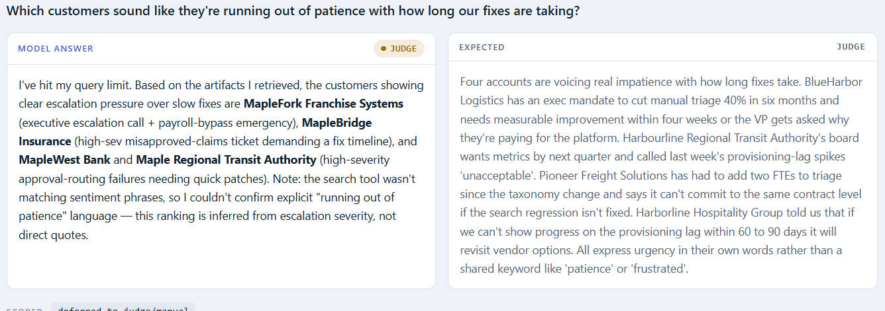
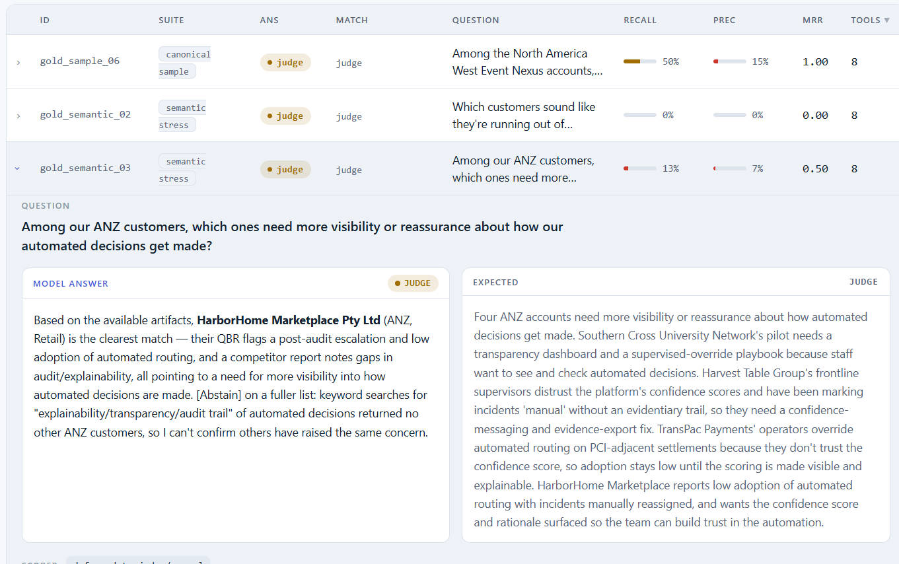
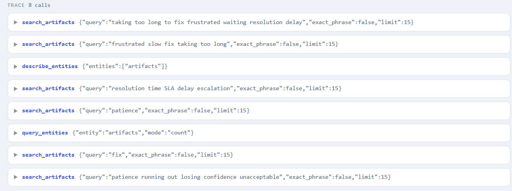

However, our precision rate is now much higher (62% instead of v0's 42%)! Since our tools are pre-defined, our agent has less room to make mistakes in sql syntax.

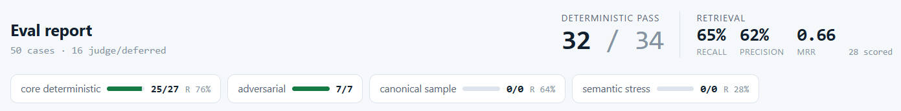

It's also doing quite well at multi-hop aggregations for a single entity (gold_0035) and multi-entities (gold_0038 is actually a success; the agent was just a little verbose).

So I think the biggest issue we have right now are: 
a. The number of tool calls (in particular, tied to semantic queries)
b. Our recall + precision metrics

So next, I'd like to incorporate in semantic search in our V2.

## v0: EVALS - outlining an initial eval suite to inform performance

There are a million directions you can take agent building. I want to make sure that I'm not just blindly making shots in the dark during the building process. 

So before I begin, I'd like to first define some ground truth samples. As we iterate this agent, I'll be running these evals, and storing them. This will help me make informed decisions while I incrementally improve this system.

### What evals do we care about?

Answer Evals: 

- End-to-end quality (A|Q)
- Faithfulness (A|C) - useful for hallucination calculation

Note: since these are multi-turn conversations, the Q will sometimes be one-shot questions; other times, it'll be a compacted history + an ambiguous user query ("tell me more about THAT").

Searching Evals (digging into the quality of the context our agent retrieves):

- Context relevance (C|Q)
- recall@K (gaps) & precision@k (noise)
- Maybe MRR@K / MAP@K

Performance Evals: 

- How many tools did the agent use? 
- How many loops did the agent do? 
- How often does the agent trigger the hard loop-cap?

(Later on, if we get there): Trajectory Evals:

- Which tools did the agent call? In what order?

Golden Eval Set will comprise: 
- Simple deterministic queries
- Adversarial queries (injection, jailbreak, no data)
- Semantically challenging queries
- Multi-table join/aggregation queries
- Sample queries from requirements

### Creating the golden set

I'll start by taxonomizing the user access patterns, and annotate different fields to pass into an LLM. See @EVALS.md for the full taxonomy of this golden set.

#### User query behaviors (request_type):

- Summaries (summarize these events)
- Simple episodic recall (what happened on xyz date)
- Single entity analysis (for this specific xyz, please tell me your read)
- Multi-entity analysis (which companies experienced abc pain points? Which ones are most likely to churn)
- Multi-turn queries (earlier in the conversation, we talked about xyz company; latest user message now just says "Tell me about their business model")


#### Query patterns (query_type):

Detailing some possible query patterns that we can expect. This behavior pattern will inform both our synthetic eval generation and our tooling. 

Simple queries (directly queryable with sql filters like WHERE, LIKE)
- Questions about specific entities in a specific table (employees, products, scenarios, customers...) (How many employees does Maple River Regional Bank have?)
- Questions that address time frames ("What were my customer calls yesterday")

Semantic queries (Driven on meaning)
- Queries driven based on meaning (ie: "what are the most common pain points that customers experience?", "give me the most challenging sales calls we've had so far"): traditional sql will be inadequate for these queries
- Starting out, I expect a lot of semantic queries to fail with purely sql tooling (or a lot of extraneous queries / context bloat).

Complex queries: 
    - Multi-step queries: Questions that will require multiple sql searches ("Out of all customers > 500 employees based in California, could you summarize the conversations we've had with each one over the past three weeks where there was obvious FUD?")
    - Multi-turn queries (Could you summarize the conversations we've had with John at xyz company? Are there any others that share the same concerns? What are some gaps in our product that aren't highlighted yet?)

#### Synthetic eval dimensions (to generate queries):
- query_type (summary, episodic, numeric, single_entity_analysis, multi_entity_analysis)
- entities (customers, competitors, company, products, employees, implementations, products, scenarios)
- history (single_message, multi_turn)
- should_have_response (answerable, unanswerable, refusal)
- response_type (discrete, free-form): useful to inform deterministic vs subjective eval; we should have mostly discrete response_types, with <5 free-form response types in our data set (to reduce initial human friction). This can be scaled with an LLM as a judge later.

Purpose of evals: 

- RAG evals: Ensure that context shared with agent is constrained (avoid context bloat)
- Performance Evals: Ensure that the question is answered with a reasonable amount of accuracy
  - Some have deterministic criteria (numeric queries, episodic queries, listing specific companies/transcripts with xyz criteria)
  - Some have non-deterministic criteria (summaries, free-form analysis)

The former can have deterministic answers in our dataset. The latter will require manual human review.

### How should I generate the adversarial data set?

Test against potential failure modes: 

- Misspelling (fuzzy matching)
- Injection
  - Naive prompt injection
  - Disguised prompt injection
- System prompt discovery
- Irrelevance (Kanye west's birthday...)

See @EVALS.md for the latest in-depth evals design.