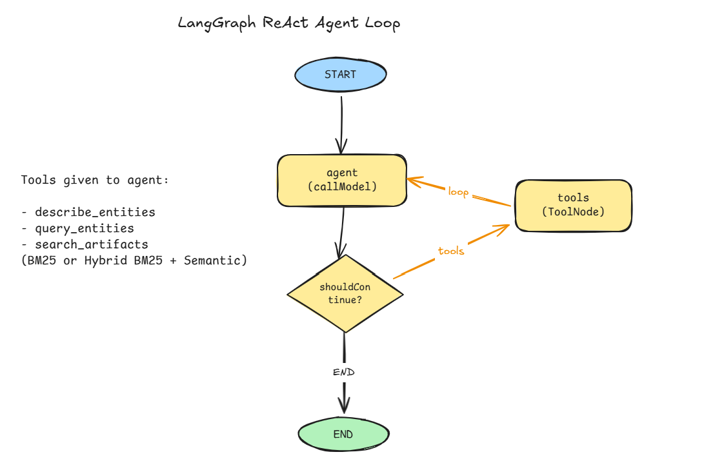
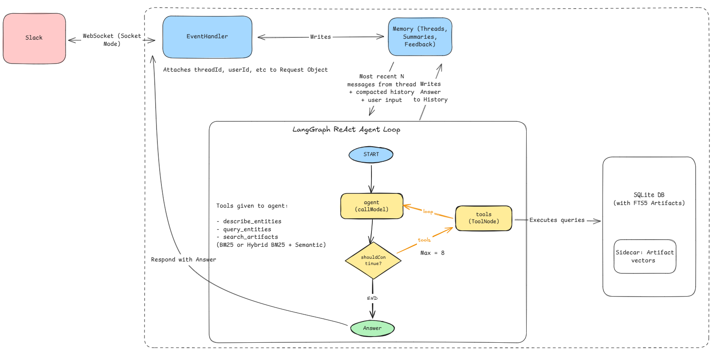

# Design Overview

Socrates is a Slack Q&A bot grounded in a SQLite database of synthetic startup data (customers, implementations, artifacts like call transcripts and support tickets, employees, competitors, products). You @-mention it in a channel, it figures out what you're asking, queries the database with a small set of purpose-built tools, and replies in-thread. It supports multi-turn conversations, compacts long threads so context doesn't bloat, and records 👍/👎 reactions as feedback for future evals.

## Agent architecture





The two graph nodes (`agent`, `tools`) and one conditional edge are the entire loop; everything else in the system either feeds it (Slack handler, thread memory) or consumes its output (answer delivery, feedback capture).

This doc is the bird's-eye view. The details live in:

- `DESIGN.md`: the build log, version by version, with the reasoning behind each decision
- `TOOLS.md`: the tool contracts (params, behaviors, safety)
- `EVALS.md`: the eval suite design and taxonomy
- `SETUP.md`: how to run it

## How a question flows through the system

1. A user mentions @Socrates in Slack. The app runs in Socket Mode (websocket, no public endpoint), so it can run from any machine with the two Slack tokens.
2. Socrates reacts 👀 and posts a "thinking" message, updating it about once a second with tool-call progress so the user knows it's working (`src/slack/handlers.ts`).
3. The thread's history is loaded from a local SQLite store (`src/memory/thread-store.ts`). If the thread is long, older messages have already been compacted into a summary.
4. A ReAct-style LangGraph agent (`src/agent/index.ts`) loops between an Anthropic model and a tool node until the model decides it has the answer, or hits the 8 tool-call cap.
5. Every tool call passes through a gateway (`src/agent/gateway.ts`) that carries the Slack user/channel/thread context, runs an `authorize` check (stubbed today), and emits a structured audit log line.
6. The "thinking" message gets edited into the answer. If the user reacts 👍 or 👎, that lands in a feedback table (`src/memory/feedback-store.ts`) to seed future regression tests.

## The agent

A plain ReAct loop, nothing exotic:

```
agent -> (wants tools?) -> tools -> agent -> ... -> END
```

I skipped one-shot and deterministic pipelines because we don't know the SQL queries ahead of time, and feeding the whole dataset into the model would be expensive and unreliable. The loop is bounded: 8 tool calls per question, and once the cap is hit the model is re-invoked without tools and told to answer (or abstain) with what it has.

The system prompt pushes three behaviors: answer like a short Slack message rather than a report, prefix `[Abstain]` when the database can't answer instead of guessing, and prefix `[Refuse]` for off-topic or adversarial requests. Those markers are what the eval suite checks against.

## The tools

Three parameterized tools, no free-form SQL anywhere (see `TOOLS.md` for the full contracts or `DESIGN.md`for the detailed decision logs ):

- **`describe_entities`**: returns exact column names, foreign keys, and enum value sets for any tables the model is unsure about. This is how the model gets `"at risk"` right on the first try instead of guessing `"at_risk"` and burning a call.
- **`query_entities`**: structured lookups, filters, counts, and aggregates over one table at a time. Joins are disabled for filtering and row-fetching (bad joins are a classic failure mode); the model chains calls instead. The one exception is a single-hop cross-table `group_by` via a foreign key, which only goes in the many-to-one direction so aggregates can't double-count.
- **`search_artifacts`**: hybrid search over artifact text. Each query runs BM25 (SQLite FTS5) and a semantic pass (OpenAI embeddings, cosine similarity against a precomputed local index), fused with Reciprocal Rank Fusion. Filters (customer, product, type, dates) scope both sides, so one call can scan a whole candidate set.

Why hybrid instead of a separate semantic tool? Fewer tool calls, less surface area for the agent to make mistakes, and wider recall: the agent doesn't need to know that semantically relevant artifacts exist for them to surface. The embeddings live in a local sidecar file (`artifact_embeddings.bin`) rather than a vector DB, because that's the simplest approach at 250 artifacts. In production, I'd wire this through to Pinecone or pgvector.

Content fingerprints are checked on load, so a stale index fails loudly instead of silently ranking against drifted data.

## Memory

Each Slack thread is one conversation. That gives users a clear way to start fresh, and gives us a natural key for storage. Messages are persisted per-thread in SQLite; when a thread passes 16 messages, the older ones get summarized into a `thread_summaries` row and only the most recent 8 stay verbatim. So "tell me more about that" works in a 100-message thread without piping 100 messages into context.

Socrates also listens passively: messages in a thread it's been tagged into get saved even when it isn't mentioned, so when someone pulls it back in as an arbiter, it has the intervening context. It only runs and replies when actually tagged.

Organizational memory, cross-thread memory, and per-user memory are all deliberately out of scope.

## Security

The audience is trusted (people added to a Slack channel) and the transport is Socket Mode over TLS, so the posture is defense in depth:

- Read-only, query-only SQLite connection: mutations fail at the database layer
- Every table, column, operator, and aggregate is checked against a hardcoded allowlist inside the query builder itself, and every value is bound as a SQL parameter
- Input normalization with max lengths on user messages and search queries
- Hard tool-call cap to bound runaway loops
- A log-only Haiku classifier tags each question as on_topic, off_topic, or injection_attempt (not in the critical path yet; it needs its own eval before it gates anything)
- An adversarial eval suite covering injection, prompt leaks, roleplay jailbreaks, and scope escalation
- `authorize` and `audit` are stubbed but wired through every tool call, ready for a real permissions system and real logging infra

## Evals

Evals came first (v0), before any agent code. I started out by taxonomizing the query access patterns across a number dimensions. The initial draft is in DESIGN.md, and the polished output is in EVALS.md.

The suite is 50 core cases in four buckets: 30 deterministic (answers computed from the frozen DB), 8 adversarial, 7 canonical requirement samples kept exactly as worded, and 5 deliberately hard semantic-stress cases. Plus a 14-case challenge bank that doesn't count toward the core aggregate.

Every case has two independent scores: answer correctness (exact/numeric/set/ranked matchers, plus abstain and refuse checks) and retrieval correctness (recall, precision, and MRR over the evidence IDs the system surfaced, method-agnostic). Performance counters track tool calls per question and cap hits.

## Results

Between v0 (a single free-form `run_sql` tool as the control) and the current version: recall went from ~60% to ~80%, precision from ~42% to ~60%, MRR from ~0.5 to ~0.8. No query in the suite needs more than 6 tool calls, down from regularly slamming into the 8-call cap on semantic questions. The full report is at `eval_reports/final_eval_report.html`.

The version history in short:

- **v0**: eval suite and taxonomy, plus a free-form SQL baseline to measure against
- **v1**: structured tools replace free-form SQL; precision jumps, semantic queries still flail
- **v2**: hybrid search (BM25 + embeddings + RRF); semantic recall and tool counts improve a lot
- **v3**: multi-turn threads, compaction, passive listening
- **v4**: progress updates in Slack, reaction-based feedback into a DB
- **v5**: input bounds, the log-only topic/injection classifier, security writeup

For more details on each design decision, see @DESIGN.md

## What's next

The list I ran out of time for: an LLM judge for the free-text cases (and an adversarial refinement loop on top of it), a router that sends easy deterministic questions to cheaper models, putting the classifier in the critical path once it has its own eval, and continuing to push recall and precision on the semantic-stress cases.
